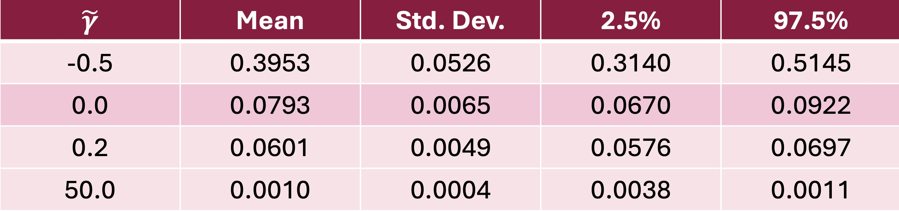
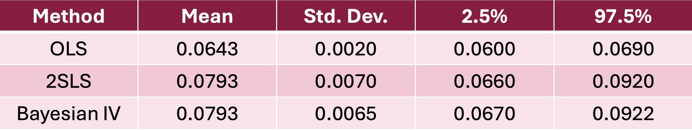

# Portfolio

## Project: Bayesian vs Frequentist Approach: A Comparative Study of Educational Returns to Income in Germany 

The importance of education goes well beyond the classroom and substantially influences many aspects of our lives. In this project I focus on the effect of education on income in Germany. This relationship is not only important
for understanding an individual’s economic success but also reflects broader social dynamics such as access to
opportunity and economic inequality.

In this project I analyse:
1. Potential endogeneity of the variable education (Blackburn and Neumark, 1993)
2. Validity of father's education as the instrumental variable
3. Compare the Bayesian and frequentist approach in analysing the relationship between education and income

### Econometric Model

To estimate the effect of the explanatory variable $education$ on the dependent variable $log(income)$, I specify the following equation:

$log(income) = \alpha_1 + \beta \ education + \sum_{i=1}^{m} \delta_{1i} w_1 + u_i$

where $\beta$ is the coefficient which measures the effect of one’s own education on income. The $m$ control variables are expressed by $w_i$ and are assumed to be exogenous. $\alpha_1$ is a constant and $u_1$ is the error term with $E[u_1]=0$. 

I assume the variable $education$ to be endogenous and use instrumental variable (IV) regression to address endogeneity. Implementing this idea, results in the following equation:

$education = \alpha_2 + \delta z + \sum_{i=1}^{m}\delta_{2i} w_i + u_2$

where $z$ refers to the instrument $father's \ education$ and $\delta$ measures the effect of the instrument on $education$. The error term is $u_2$ and $\alpha_2$ is constant.

In the Bayesian approach I allow for a small direct effect ($\gamma$) of the instrument $z$ on $income$. Therefore I redefine the model as:

$log(income) = \alpha_1 + \beta \ education + \gamma z + \sum_{i=1}^{m} \delta_{1i} w_i + u_i$

The ratio of the effect of the instrument and the individual's own education on income is defined as $\tilde{\gamma} = \frac{\gamma}{\beta}$ because it is easier to construct prior beliefs about the ratio rather than the direct effect of the instrument on the dependent variable.

### Method: Gibbs Sampling

I use Gibbs sampling, a Markov Chain Monte Carlo method, to approximate the posterior density by using the conditional distribution (Geman and Geman, 1984). The sequence of samples forms a Markov chain whose stationary distribution is the posterior distribution. I discard the first part of the Gibbs sequence by establishing a burn-in of 1,000 draws from the 11,000 simulated draws. 

### Instrument Robustness Test

The exclusion restriction for instuments states that a valid instrument should not be correlated with the error term. The instrument should not directly affect the dependent variable but only indirectly through the endogenous explanantory variable. 

I expect the exclusion restriction to be violated in this case. I suspect that the instrument $father′s\ education$ has some degree of direct effect on the dependent variable and therefore violates the exclusiion restriction. Bayesian analysis makes it possible to test the robustness of the results under different assumptions. I incorporate the direct effect on the dependent variable through
a prior distribution. I start with a prior around zero and slowly increase the direct effect of the instrument. With this approach, I can make sure that the results are reliable (Hoogerheide et al. (2012a)).

  

The results of the robustness test indicate that the increase of posterior uncertainty with a relaxed exclusion restriction is no greater than the uncertainty associated with a strict exclusion restriction. Hence, for the project I assume a perfectly valid instrument.

### Results: Comparing Bayesian and Frequentist Approach

  

The Bayesian IV and 2SLS estimates imply that an additional year of education on average results in an approximately 7.93% increase in income. Both the Bayesian IV and 2SLS estimates perfrom simiarly well. The downshift of the OLS estimate implies OLS underestimates the true causal effect if educatio.

### Results: Comparing different Education Levels

To investigate if the effect of education is different for people with different levels of education and I divide the dataset into higher and lower levels of education. The findings show that individuals with lower education levels benefit the most from additional education, with an increase in income of nearly 30% for an additional year of education compared to 10% for individuals with higher education levels. These findings highlight the importance of expanding access to education and early interventions to counter educational inequality.
